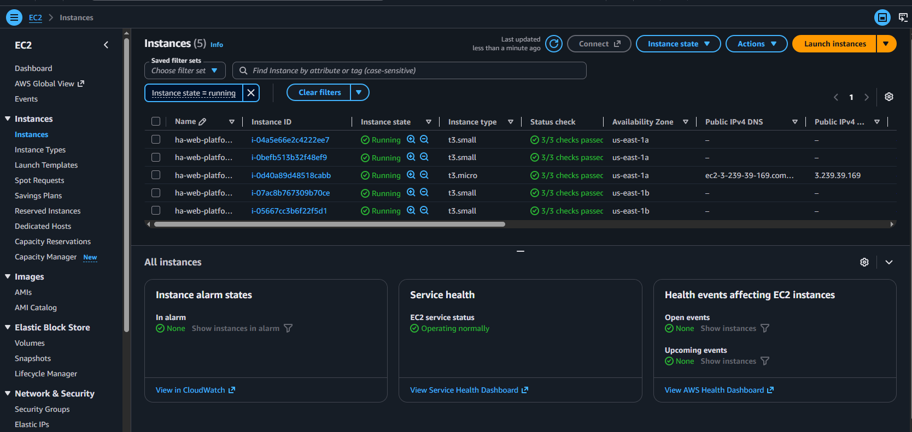
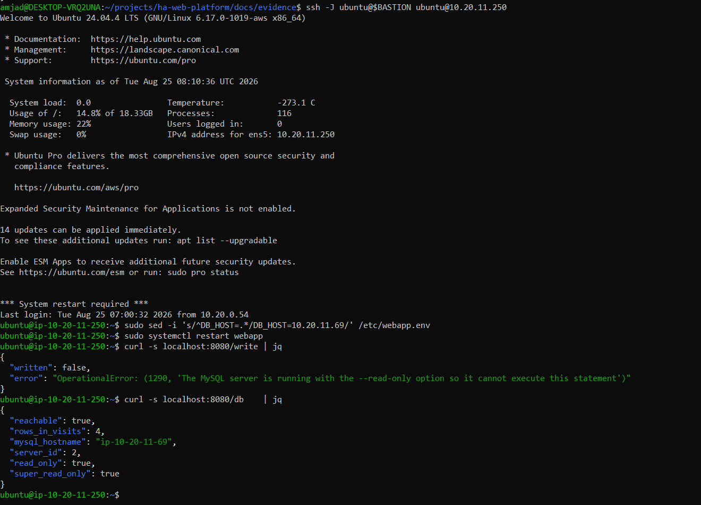
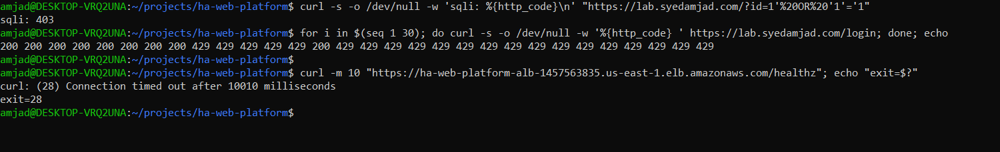
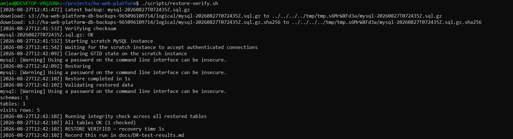
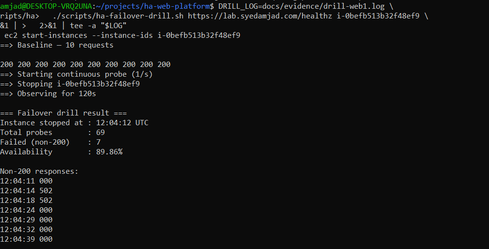

# Secure High-Availability Web Platform

A load-balanced, multi-AZ web platform on AWS with MySQL GTID replication, encrypted backups, and a WAF at the edge — **built, then deliberately broken, with every recovery number measured rather than claimed.**

Terraform provisions it. Ansible hardens and configures it. Then a set of drills stops instances, refuses writes, and restores backups into a throwaway database to find out what actually happens.

> **The infrastructure is not the deliverable.** Anyone can draw a diagram with two web servers and a load balancer. What almost nobody does is stop the server and measure how long the site was degraded. That measurement is the point, and it lives in **[`docs/DR-test-results.md`](docs/DR-test-results.md)**.

---

## Measured results

| Drill | RTO measured | RPO measured | Failed requests |
|---|---|---|---|
| Web node loss (`web-1`) | **0s** full outage · 28s degraded | 0 | 7 of 69 |
| Web node loss (`web-2`) | **0s** full outage · 27s degraded | 0 | 7 of 68 |
| Restore from S3 backup | **1s** restore · 24s end-to-end | ≤ 5h (nightly schedule) | n/a |
| DB primary loss → replica promotion | *not performed* | — | — |

| Control | Test | Result |
|---|---|---|
| GTID replication | `SHOW REPLICA STATUS` | Both threads `Yes`, `Seconds_Behind_Source: 0` |
| Replica rejects writes | `/write` against a repointed app node | Error **1290**, `super_read_only: true` |
| WAF blocks injection | `?id=1' OR '1'='1` | **403** |
| Login rate limiting | 30 × `GET /login` | 8 × `200`, then `429` (Cloudflare **1015**) |
| **Origin cannot be reached directly** | `curl` the ALB hostname | **Timeout, `exit 28`** |

The database failover row is empty because that drill was not run. An empty row is more useful than a guess — the manual procedure is in [`docs/RUNBOOK-failover.md`](docs/RUNBOOK-failover.md), and automating and measuring it is the obvious next piece of work.

---

## Architecture

```
                              Internet
                                 │
                    ┌────────────▼──────────────┐
                    │        CLOUDFLARE         │  WAF · rate limiting
                    │   TLS · DDoS absorption   │  geo challenge · HSTS
                    └────────────┬──────────────┘  rules scoped to one hostname
                                 │
                    ┌────────────▼──────────────┐       ┌──────────────┐
                    │ AWS ALB  (public subnets) │       │   bastion    │  public
                    │ 443 from Cloudflare only  │       │   t3.micro   │  subnet
                    │ ACM cert · /healthz 15s   │       │  SSH from    │
                    └──────┬─────────────┬──────┘       │  one /32     │
                           │             │              └──────┬───────┘
                           │             │  ProxyJump (-J) ────┘
        ═══════════════════│═════════════│════ no public IP below this line ════
                  ┌────────▼──────┐  ┌───▼────────────┐
                  │    web-1      │  │     web-2      │   PRIVATE subnets
                  │ nginx + app   │  │ nginx + app    │   default-deny firewall
                  │ fail2ban      │  │ fail2ban       │   key-only SSH
                  │ us-east-1a    │  │ us-east-1b     │   IMDSv2 required
                  └───────┬───────┘  └───────┬────────┘
                          │ egress via       │ egress via
                          │ NAT-a            │ NAT-b   (one NAT per AZ)
                  ┌───────▼───────┐  GTID ┌──▼─────────────┐
                  │  db-primary   │──────>│  db-replica    │
                  │  MySQL 8      │  TLS  │ super_read_only│
                  │  us-east-1a   │       │  us-east-1b    │
                  └───────┬───────┘       └────────────────┘
                          │
          ┌───────────────▼──────────────────────────────────┐
          │  S3 — versioned · SSE-KMS (customer-managed key)  │
          │  nightly dump · SHA-256 recorded · restore tested │
          └──────────────────────────────────────────────────┘
```

**Nothing below the ALB and the bastion has a public IP.** Security groups reference *each other* rather than CIDR ranges, so the tiering holds even if a subnet is misconfigured, and replacing an instance changes no rule.

---

## Evidence

Full captures in [`docs/evidence/screenshots/`](docs/evidence/screenshots/). A selection:

### The network shape



Five instances, two AZs — and the **Public IPv4 column is empty for every web and database node**. Only the `t3.micro` bastion has an address. That single column is the entire private-subnet argument.

### The replica refuses to accept a write



One `sed` against `/etc/webapp.env`, one restart, and the same binary hits the replica instead — **error 1290, refused**. Note `super_read_only`, not just `read_only`: plain `read_only` still lets a `SUPER` account write, which is exactly how split-brain starts when someone connects as root to "fix one row."

### Three edge controls, one capture



Injection payload → `403`. Thirty login attempts → eight `200`s then `429`. And the one that matters most: **curl straight at the ALB hostname times out, `exit=28`.**

A WAF an attacker can walk around is decorative. `exit 28` is a *timeout, not a rejection* — packets from outside Cloudflare's ranges are dropped rather than refused, so a scanner learns nothing at all.

### A backup that was actually restored



SHA-256 confirmed, the dump restored into a throwaway container, row counts checked, `CHECK TABLE` across every table, and a measured recovery time. *A backup you have never restored is a hypothesis.*

### Failover, drilled twice



**Read the timestamps, not the percentage.** No two failures are consecutive — with one of two nodes dead, the ALB kept round-robining into the corpse until its health check caught up. The honest characterisation is a **28-second degraded window at ~50% error rate, not a 28-second outage**.

And the window is exactly the configured detection time: `interval = 15` × `unhealthy_threshold = 2`. The second drill landed within one second of the first, which is how you learn that detection time is deterministic rather than lucky — a single drill could never have told you that.

---

## The defect worth the whole project

Six defects surfaced by running the code rather than reading it. One is the reason this project exists.

After fixing a race in the restore harness, the script completed — and printed `All tables OK` **immediately after**:

```
OCI runtime exec failed: exec: "mysqlcheck": executable file not found in $PATH
```

`mysqlcheck` is absent from recent `mysql:8.0` images. The `docker exec` failed, the pipe carried nothing, `grep -v 'OK$'` exited non-zero on empty input, and the `|| log "All tables OK"` fallback fired **on that failure**.

| | What the script printed | What had happened |
|---|---|---|
| Integrity check | `All tables OK` | The binary did not exist; nothing was checked |

This is precisely the failure mode the project exists to guard against: **a verification step that is green while verifying nothing.** A backup you have never restored is a hypothesis — and a restore whose integrity check silently no-ops is the same hypothesis wearing a tick mark.

Replaced with `CHECK TABLE` driven from `information_schema`, using the `mysql` client that is always present, failing loudly on empty output and printing how many tables it checked.

The replacement then failed the *opposite* way — it captured stderr deliberately, so it also captured `mysql: [Warning] Using a password on the command line interface can be insecure`, a line that does not end in `OK` and was therefore reported as an integrity failure when the check had passed. Fixed by passing the password through `MYSQL_PWD`, suppressing the warning at source rather than filtering it afterwards.

A **false negative** followed by a **false positive**, both from the same mistake: pattern-matching mixed streams without controlling what is in them.

The full list of six is in [`docs/DR-test-results.md`](docs/DR-test-results.md), including a WAF rule that matched nothing because Cloudflare's `http.request.uri.query` is the *raw* query string, so `contains "' or '"` was being evaluated against `'%20or%20'` and could never fire.

---

## What the constraints actually were

Stated rather than quietly substituted.

**The WAF block is a hand-written rule, not OWASP.** The Cloudflare Managed and OWASP Core rulesets require Pro; on a Free zone they fail with *"not entitled to execute this managed ruleset."* The substitute matches four literal substrings after `url_decode()`. It stops the demo payload and naive scanners. It does **not** do grammar-aware detection, and an attacker who encodes or fragments the query walks past it. Claiming "Cloudflare WAF blocked SQLi" here would be overclaiming.

**Rate limiting is looser than designed.** The Free plan accepts only a 10-second counting period and mitigation timeout; the design called for 10 requests per minute with a 10-minute lockout. What is deployed stops a credential-stuffing loop, but a patient attacker gets ~60/minute rather than 10.

One request returned `200` in the middle of a blocked run. Cloudflare counts per `["ip.src", "cf.colo.id"]` — the counter is per data centre and eventually consistent. Expected behaviour for distributed edge rate limiting, not a misconfiguration.

---

## Design decisions

**One NAT gateway per availability zone, not one shared.** A single shared NAT quietly undoes multi-AZ: losing the zone that holds it removes outbound connectivity for the surviving zone too. Paying for the second one is the difference between multi-AZ and the appearance of it.

**Security groups reference security groups.** The database tier admits `3306` from the *web tier's security group*; the primary and replica reach each other through a self-reference. No private IP is hardcoded anywhere — a capability no IP-based firewall has at all.

**IMDSv2 required on every instance.** One line, `http_tokens = "required"`, closing the SSRF-to-credential-theft path behind the Capital One breach. Database nodes carry an IAM role for S3, so no long-lived access key exists on any host.

**GTID rather than binlog coordinates.** Position-based replication makes you record a filename and offset and get them right precisely when you are failing over under pressure. GTID lets the replica ask for everything it has not seen.

**Backups run on a systemd timer with `Persistent=true`.** Instances are stopped overnight for cost control, which would otherwise silently skip every scheduled backup. Verified by catch-up runs firing at `11:30Z` and `06:32Z` against a `02:30Z` schedule — worth checking, because the cost-saving pattern would have quietly disabled the backups it was built alongside.

**`/healthz` is exempt from rate limiting.** The ALB probes it every 15 seconds from a node in each AZ. Rate limit it and you eventually deregister your own healthy targets.

**`sshd` changes are validated before they are written.** The Ansible task runs `sshd -t` against the candidate file first. Without it, a typo locks you out of a host that has no public IP and no console.

---

## An outage nobody scheduled

Partway through, the database primary became SSH-unreachable while the other four nodes were fine. Ansible reported `Connection closed by UNKNOWN port 65535`.

That message *was* the diagnosis. It means the ProxyJump tunnel was established — bastion and security groups healthy — but the far end never completed an SSH handshake. A *timeout* would have meant packets disappearing, i.e. a firewall or routing fault. Reading which failure had occurred ruled out the entire network layer in one step and pointed at the host.

A soft reboot recovered it. Replication then re-established itself across an unclean primary restart with **no manual intervention** — both threads `Yes`, zero lag. An unplanned resilience test that did not have to be staged, and better evidence than any of the scripted drills.

---

## Repository layout

```
├── terraform/                  Infrastructure — VPC, subnets, NAT per AZ, ALB,
│   │                           ACM, EC2, IAM, KMS, S3, Cloudflare rules
│   └── environments/           tfvars template (no secrets committed)
├── ansible/
│   └── roles/
│       ├── common_hardening/   firewalld default-deny, sshd, sysctl, fail2ban
│       ├── nginx_app/          nginx rate limiting + the demo application
│       ├── mysql_primary/      GTID source, replication user, app schema
│       ├── mysql_replica/      super_read_only, auto-position replication
│       └── backup/             backup script, systemd timer, IAM-based S3 access
├── scripts/
│   ├── backup-mysql.sh         nightly dump → SHA-256 → SSE-KMS upload
│   ├── restore-verify.sh       restore into a throwaway container and validate
│   ├── ha-failover-drill.sh    stop a node, probe once a second, count failures
│   ├── gen-inventory.sh        rebuild the Ansible inventory from Terraform state
│   ├── lab-up.sh / lab-down.sh cost control between sessions
│   └── bootstrap-tfstate.sh    one-time remote state backend
└── docs/
    ├── DR-test-results.md      ← the measurements. Start here.
    ├── RUNBOOK-failover.md     written to be followed by someone else at 3 a.m.
    └── evidence/screenshots/   captures backing every claim above
```

[`project-overview.md`](project-overview.md) walks through the request path and explains why each component exists, for anyone who wants the reasoning rather than the results.

---

## Running it yourself

Requires Terraform ≥ 1.6, Ansible, the AWS CLI with credentials, Docker (for restore verification), and a Cloudflare-managed domain.

```bash
ansible-galaxy collection install -r ansible/requirements.yml

cp terraform/environments/prod.tfvars terraform/prod.auto.tfvars
$EDITOR terraform/prod.auto.tfvars          # admin_cidr, key_name, zone id, domain
export TF_VAR_cloudflare_api_token='...'    # exported, never written to a file

./scripts/update-cloudflare-ranges.sh       # ALB allowlist + nginx real-ip, from one fetch
cd terraform && terraform init && terraform apply && cd ..

./scripts/gen-inventory.sh
eval "$(ssh-agent -s)" && ssh-add ~/.ssh/ha-lab.pem

cd ansible && ansible-playbook site.yml \
  -e "repl_password=$(openssl rand -base64 24)" \
  -e "app_db_password=$(openssl rand -base64 24)"
```

Then run the drills:

```bash
export BACKUP_BUCKET=$(cd terraform && terraform output -raw backup_bucket)
./scripts/restore-verify.sh

./scripts/ha-failover-drill.sh https://your.domain/healthz \
  "$(cd terraform && terraform output -json web_instance_ids | jq -r '.[0]')"
```

Runs at roughly **$20–30 for a week** in `us-east-1`. Set a billing alarm before provisioning, and `terraform destroy` when finished — then check for orphaned Elastic IPs and unattached volumes, which bill quietly.

---

## What I would change for production

- **Replace the bastion with SSM Session Manager** — no SSH port open anywhere, no host to patch, no keys to distribute, every session logged in CloudTrail.
- **Use RDS Multi-AZ** unless there is a specific reason to run MySQL on EC2. Building it by hand was the point here, not the recommendation.
- **Automate promotion.** A human following a runbook at 3 a.m. is a plan, not a control.
- **Replicate backups cross-region.** Today a regional failure loses both the platform and its backups.
- **Add alerting.** Nothing pages anyone. Replication lag, backup age and target-group health should all alert — and by this project's own standard, a control nobody monitors is not really a control.

### Residual risks, stated

- Application-layer authorisation is out of scope; the demo application has no auth.
- The app trusts MySQL's self-signed certificate — **encrypted but the server is not authenticated**. Acceptable inside a private subnet reachable only from the web security group; wrong in production, where you would distribute the CA and verify.
- Single region, single AWS account.
- WAF coverage and rate limiting are bounded by the Cloudflare Free plan, as detailed above.
- Database failover is manual and has not been drilled.

---

*Lab build, provisioned in a personal AWS account and torn down after the drills. AWS account identifiers are redacted from three console captures. Written up in more detail at [syedamjad.com](https://syedamjad.com/projects/secure-ha-web-platform/).*
